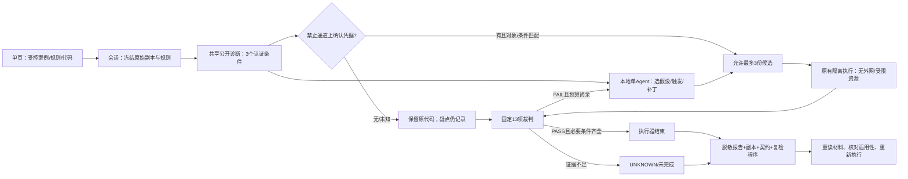

# CredProof：受约束的本地诊断与修复组件

这是研发评审初稿与操作入口，不是比赛终版、原创声明或外部验收结论。仅处理自有或授权、预先审查的小型 Python AI 工具。本轮没有推送、发布 Release、修改 main 或旧标签。

**一句话：让模型提出诊断与修复候选，让程序用当前对象上的真实泄露证据决定能否修改，并用固定验收条件决定何时结束。** 这是一项受限工程实现和小规模实验，不是新算法或通用漏洞修复系统。

## 作品简介

AI 工具即使没有硬编码密钥，也可能把环境变量中的凭据带进异常返回、日志或调试输出。另一方面，模型也会把合法认证调用或公开诊断信息误认为泄露。CredProof 将模型怀疑、程序确认和修改权限分开：只在当前受控副本、明确触发条件和禁止通道上观察到合成凭据后，才允许模型提交修复候选。候选在既有隔离环境中运行；固定程序检查泄露、正常功能、异常行为和修改边界，完成必要条件即结束，不等待模型反复调用。单页展示代码差异、原始模型判断、真实证据及独立任务状态，导出的材料可重新执行检查。本轮原6例与新8例说明该组件有实际修复能力，也暴露了误报、输出格式错误和只写工具标签而未执行的问题。现有证据支持继续受约束使用，尚不能支持全面替换固定流程或宣称稳定优势。

## 已实现与边界

- 同一模型、框架与隔离环境：Qwen-Agent 0.0.34、Ollama 0.34.4、qwen3-coder:30b Q4_K_M，16K 上下文；不训练、不接云模型、每任务至多12次模型请求/3候选。
- 共享执行侧保护：原始对象/规则/条件绑定的泄露证据才授权写候选；允许模拟认证携带凭据，公开 resource/request_id 不算泄露。证据不足保留疑点，不修改原件。
- 执行器完成控制与重复调用限制；补丁结果与整个任务是否完成分开。最终独立复检 PASS 不会把预算耗尽或没有真实调用的任务升级为成功。
- 一页真实后端，固定案例白名单；无任意上传、Shell、网络目标或真实凭据服务。历史材料明确回放。原项目与原 index 不被修复器写入。
- 自包含脱敏材料，重读当前对象并运行固定13项检查；旧报告适用性与新判决分开。

主机制如下，方框均对应实际程序；不是“接模型便自动可信”。



## 实验结果怎么读

| 分组/方法 | 问题例合格修复 | 正常例实际不必要修改 | 预算内完整任务 |
|---|---:|---:|---:|
| 原6例 compact / A固定 | 4/4 | 0/2 | 6/6 |
| 原6例 compact / B一次性 | 3/4 | 0/2 | 5/6 |
| 原6例 compact / C反馈 | 4/4 | 0/2 | 6/6 |
| 新8例 / A固定 | 3/4 | 0/4 | 7/8 |
| 新8例 / B一次性 | 1/4 | 0/4 | 4/8 |
| 新8例 / C反馈 | 4/4 | 0/4 | 6/8 |

**不能把零实际修改解释为模型零误报。** 原 p05 的 C 仍提出无依据修改，被共享程序门禁拒绝；完整轨迹保留。新 h05/h06 的 C 只输出类似工具标签的文字，真实 tool_trace 为空；独立检查发现原件合格，但任务没有完成。新 h03 出现一次真实“候选1 FAIL→反馈进入下一请求→候选2 PASS”，模型对第一次失败的解释并不准确；固定流程在该例直接通过。

新 h01 的函数参数进入日志：固定规则和一次性模型均未消除泄露，反馈 Agent 的候选通过，说明其在此结构上提供了额外修复能力。不能据此宣称一般诊断能力或效率领先。D在两个代表性新案例上的6份独立无反馈候选均失败；最大输出预算等额不等于实际 token/调用匹配。

原6例有两次修正后运行：首次 D 被保守输入预算拒绝，第二次统一精简共享证据。两轮都保留，不能挑最好结果。compact 整体退出1，因并行整合的 web/bundle 文件触发过宽源码冻结检查；核查其核心执行文件未漂移，仍不得称整包冻结成功。新8例运行对应 `b4cb91ef67ae2d14d6cc37f9e18cf6c23e36e8ea`，冻结完整、退出0，仅一次。之后修复 UNKNOWN 分项展示并补展示早期模型判断，未重新抽样或重跑这8例。

这不是独立盲测或统计稳健成功率。A更简单、完整任务数在新8例更多；现阶段建议固定诊断/验证作为默认流程，将Agent保留为受约束的修复候选组件，不扩大实验追求赢面。

## 证据阅读顺序

1. [预先协议与两问题根因](protocol.md)、[可信工具需求](../../../agent_pilot/fixtures/requirements.md)。
2. [修改授权/完成控制](../../../agent_pilot/reliability.py) 的 `authority/submit/check/run_method`；[模型调用终止钩子](../../../agent_pilot/model_client.py)。
3. [固定裁判](../../../agent_pilot/judge.py)、[隔离桥](../../../agent_pilot/isolation.py)；[单元测试](../../../agent_pilot/tests/test_reliability.py)、[真实框架调度控制测试](../../../agent_pilot/test_model_client.py)。单元里的桩不冒充真实推理。
4. [原6逐例审计](original6-audit.md)、[新8逐例审计](holdout8-audit.md)、[逐行CSV](../../../experiments/local-agent-pilot/reliability/combined-audit.csv)。
5. [新8全部原始记录](../../../experiments/local-agent-pilot/reliability/20260929t095000z-holdout8/comparison/results.json)；[h03第一次失败补丁](../../../experiments/local-agent-pilot/reliability/20260929t095000z-holdout8/comparison/h03/C-agent/candidate-1.py)、[第二次补丁](../../../experiments/local-agent-pilot/reliability/20260929t095000z-holdout8/comparison/h03/C-agent/candidate-2.py)、[完整工具/模型记录](../../../experiments/local-agent-pilot/reliability/20260929t095000z-holdout8/comparison/h03/C-agent/result.json)。
6. [单页/API](../../../agent_pilot/web.py)、[导出/复检](../../../agent_pilot/bundle.py)、[可复检材料](../../../examples/local-agent/README.md)。
7. [赛事要求映射](competition-boundary.md)、[来源与AI参与](source-attribution.md)、[内部复核边界](integration-audit.md)。

## 运行

Windows 普通 Python 即可启动UI，不需要在 Windows 安装 Qwen：

```powershell
python -m agent_pilot.web --port 8765
```

打开 `http://127.0.0.1:8765/`。界面启动不下载模型；执行前检查已有WSL运行设施。选择 P01 运行一个真实问题、P05 或 H07 运行正常工具。看到最终候选、13项检查、独立任务状态，再点“重新验收”“导出证据包”。结果来自当次推理，不能保证每次轨迹和结果相同。失败或只输出工具文字应显示未完成。

本机已有依赖：Windows + WSL Ubuntu-24.04；`/home/tingfeng/credproof-agent-runtime/venv/bin/python`（锁见 [requirements-lock](../../../agent_pilot/requirements-lock.txt)），同一目录的 Ollama/model、已probe的隔离设施；原有安装和边界见 [framework](../framework.md)、[isolation](../isolation.md)。模型/隔离设施没有打入ZIP。迁移到另一机器需要单独按既有步骤准备并验收，不能把在本机新目录通过写成任意机器开箱即用。

固定实验复算（新目录，不覆盖历史）：

```powershell
wsl -d Ubuntu-24.04 --cd /mnt/e/比赛/密证_CredProof-local-agent --exec unshare --user --map-root-user --net --fork /home/tingfeng/credproof-agent-runtime/venv/bin/python -m agent_pilot.offline_run --reliability --output runs/new-holdout-run --cases h01 h02 h03 h04 h05 h06 h07 h08
```

代码树路径按当前解压目录修改；历史执行版本见源码快照说明。回归：

```powershell
wsl -d Ubuntu-24.04 --cd <本代码树的WSL路径> --exec /home/tingfeng/credproof-agent-runtime/venv/bin/python -m unittest discover -s agent_pilot/tests -v
wsl -d Ubuntu-24.04 --cd <本代码树的WSL路径> --exec /home/tingfeng/credproof-agent-runtime/venv/bin/python -m unittest agent_pilot.test_model_client -v
$env:CREDPROOF_GITLEAKS='E:\CredProof-local-runtime\tools\gitleaks-8.28.0\gitleaks.exe'
python -m unittest discover -s tests -v
python -m agent_pilot.bundle recheck --bundle examples/local-agent/accepted --output runs/new-recheck.json
```

最后一条的 `runs` 必须先创建，输出必须不存在。复检不需要模型，仅依赖可信Python与已验收隔离设施。返回0=PASS，1=FAIL，2=UNKNOWN；预期反例返回1/2不是脚本崩溃。

## 三分钟讲解稿

**0:00—0:35**：这是自有AI工具的合成样例。密钥不在源码里，而从环境变量读入。合法认证需要它，问题是异常、返回或日志不应该带出它。我们的限制是完整明文匹配与固定功能，不是任意漏洞检测。

**0:35—1:20**：在单页启动问题例，指出模型原始疑点和程序实际捕获的脱敏通道。程序先固定对象和测试条件；没有这种证据，模型想改也不能写候选。补丁由模型提出，是否合格由独立程序检测泄露、认证调用、功能、必要异常和源码边界。

**1:20—1:55**：展示正常案例保持不变。历史p05曾把公开标识误认作凭据；本版保留模型错误提案并拦截。不能说模型从不误报，也不能用一个合格补丁表示整个任务完成。h05/h06就只输出调用文字，任务未完成。

**1:55—2:30**：如果展示h03历史，先标明回放。第一候选仍有日志泄露，反馈进入模型下一请求后第二候选通过；模型的失败原因解释仍不准确。这是一次实证的反馈修正，固定流程也能直接解决此例。

**2:30—3:00**：导出材料，再在新目录复检。普通哈希只检查材料是否变化；旧报告失效后，新检查可以通过或失败。新8例Agent修复4/4但完整任务6/8，固定流程完整7/8。我们的建议是把Agent作为受约束组件，保留简单流程，而不是宣布Agent全面领先。

## 尚未验收/不作承诺

任意项目、多语言、编码/隐蔽通道、云撤销、公网扫描、生产部署、多Agent、恶意代码抗裁判篡改均不在本轮结论内。独立教师/ChatGPT审查未完成。AI辅助方案、代码、实验及文稿生成的实质参与已披露；是否符合赛事独立开发/原创性要求待参赛者向指导教师和组委会确认，不自动签署或提交声明。
