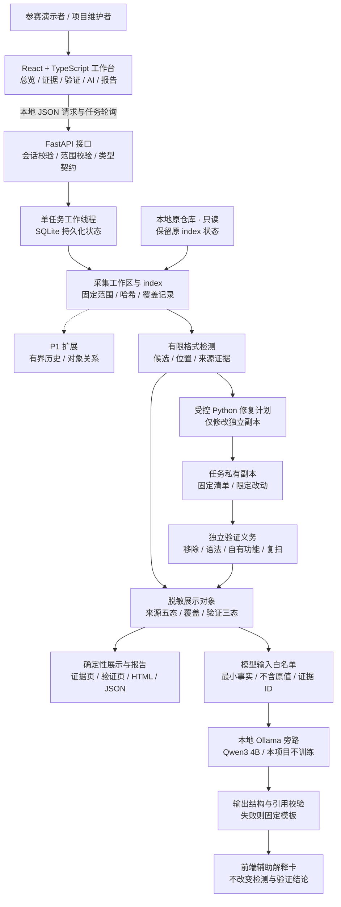
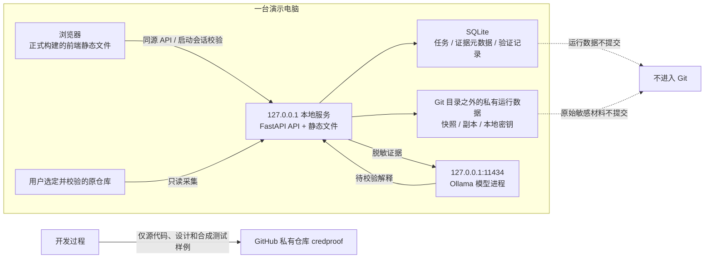

# 密证 CredProof：前端优先方案 V2

版本：DESIGN_REVIEW_V2。日期：2026-09-28。状态：待评审；Git 管理已启用，业务开发尚未开始。

## 1. 本次建议

保留题名 **“密证——面向代码仓库的凭据暴露研判与可验证修复系统”**，对外副标题采用 **“从发现到验收，让每一次修复有据可查”**。产品形态改为有完整视觉设计的 Web 安全工作台。作品最值得演示的结果是：一条风险如何被发现、解释、修复并逐项验证；为什么副本验证通过后，原暂存区的风险仍然保留。

总体路线为 **React 精致前端 + FastAPI 精简后端 + 本地轻量模型解释 + 可复核的修复证据**。主创新继续放在“快照绑定的修复验证”，让模型帮助人理解证据；不靠模型独立判断凭据是否已清除。

你的条件是：你负责核心判断和验收，每天约 4—5 小时；队友负责 PPT 与文档；Codex 承担主要实现、调试与实验整理；必要时可使用 5090。按 14 天计算，你有约 56—70 小时可投入。计划因此要减少后端能力广度，把时间留给界面、真实闭环和可复现实验。Codex 可以加速工程，但需求判断、结果检查和答辩理解仍需要你参与。

## 2. 相对 V1 的具体调整

| 方面 | V1 | V2 决策 |
|---|---|---|
| 主界面 | Streamlit 结果页 | React + TypeScript + Vite；独立设计导航、证据列表、修复差异与验收时间线 |
| 产品气质 | 工程实验工具 | 清晰、克制的专业安全工作台；深色导航、浅色内容、青绿主色和少量风险色 |
| 模型 | 首版不接入 | 直接调用现成轻量预训练模型做本地推理；不预训练、不微调、不建立 RAG |
| 后端 | 三来源、结构关系、完整验证同时推进 | 一个服务、一个任务工作线程、SQLite；工作区和 index 优先，历史与复杂关系后置 |
| 主亮点 | 三项贡献并列解释 | 一个核心贡献：修复验证契约；来源状态和模型解释服务于这个闭环 |
| 实验 | 240 样本与完整扩展矩阵 | P0 使用较小冻结样本和必要反例，P1 才扩展规模；真实性不缩水 |
| 交付方式 | 文档和静态架构图 | 文档、可点击视觉原型、可编辑架构图、私有 Git 仓库 |

“后端一般”落实为少模块、少依赖和窄支持范围。验证真假、来源范围、任务失败和敏感数据处理属于作品可信度的底线，仍需准确实现。

## 3. 作品要解决的一个问题

开发者把硬编码测试凭据改成环境变量读取后，页面显示“没有发现”，并不充分说明修复成立：旧 index 可能还保留原值；代码可能带原值作为默认项；检查过程中可能漏掉文件；修改后也可能无法运行。

密证拟将这次修复绑定到明确的内容快照，在独立副本中修改，并分别出示目标值移除、语法、限定功能、复扫和覆盖范围证据。报告中区分“指定副本通过验证”“原来源中的剩余暴露”和“凭据是否撤销”，最后一项由账号所有者另行处理，系统不做在线账号验证。

一句答辩表述：**我们把一次修复做成可以检查的证据链，知道检查了什么，也明确哪些风险还没有消除。**

## 4. 范围分层与取舍

| 层级 | 必须交付的内容 | 不完成时如何处理 |
|---|---|---|
| P0：正式最小作品 | 五个前端页面；工作区/index 真实取证；四类基础候选；有限 Python 副本修复；验证义务与剩余风险；HTML/JSON 脱敏报告；冻结最小实验 | 核心闭环未通过就继续修正，不声称作品完成 |
| P0：模型接入路径 | 本地模型适配接口、一次有证据引用的真实生成、超时与禁用回退；模型不影响扫描和验证 | 未实测真实推理时只标“预留接入”，不能把模板冒充模型 |
| P1：有余量再做 | 当前指定 ref 最近至多 10 个 first-parent 提交；有限同对象 AK/SK 关系；更多样本与筛选细节 | 界面显示“未检查”或“暂不支持”，P0 不依赖它们 |
| 不纳入这次作品 | 全网搜集、多租户权限、任意仓库运行、自动吊销、自动重写历史、多模型编排、向量库、训练和微调 | 不在页面中以可用功能宣传 |

四类基础候选为格式明确的 Token、AK/SK 字段候选、数据库连接串中的口令、PEM 私钥。P0 的 AK/SK 字段命中不等于已确认匹配；关系判断未完成时显示待研判。弱口令字段或通用字符串单独标为弱候选，不混入高置信结果。

有限自动修复针对 Python 模块中可静态识别的简单字符串赋值，在副本中改成无明文默认值的环境变量读取。其他类型提供具体人工建议。JSON 中替换为 `${TOKEN}` 不一定能生效，不能作为通用自动修复。

P0 的功能验证仅运行随作品提供、已审阅的自有样例；外部仓库若没有合适的受控功能用例，必须展示该义务为 UNKNOWN，不能授予同等级的“完整验证通过”。

## 5. 总体架构

下图描述计划实现的系统，不代表这些模块已经完成。前端只接触脱敏展示对象；扫描真值、修复状态和范围契约由后端确定。

这里的模块是同一服务内部函数和数据结构，不分别部署成微服务。后端以串行任务减少并发和状态同步问题，前端通过轮询显示真实步骤。模型是可停用的本地旁路，失效不会阻塞扫描和验证。

## 6. 部署与信任边界

正式演示优先采用前端打包后由同一本地服务提供静态资源，避免必须同时维护两个开发服务器。开发期可用 Vite 代理 API；生产演示绑定回环地址、校验启动会话及允许的 Origin，不能把 localhost 本身当成完整的访问控制。端口、模型路径和数据目录均进入本地配置，配置不进 Git。

普通 CPU 负责扫描与验证。模型使用可用的 CPU 或 GPU；5090 的作用是缩短推理等待，具体速度要实测。首版不要求 GPU 才能运行核心流程。开始实施时再锁定依赖版本和模型摘要，当前只确定技术路线。

## 7. 创新性与产品表达

| 层面 | 可以主张的内容 | 需要的验证 |
|---|---|---|
| 工程主贡献 | 将修复绑定到快照、固定范围和独立验证义务，证据不足时拒绝给出通过 | 含残留值、范围变小、源版本变化、无功能证据等案例的正确判定 |
| 状态可信度 | 将工作区、index 和可选历史的状态分别保留，副本通过不抹除原来源风险 | 源状态矩阵和前后快照对照 |
| 交互贡献 | 同一界面连通发现依据、修改差异、逐项验证和剩余处置 | 按预先定义的任务完成操作，记录可解释性错误和操作步数 |
| 模型辅助 | 将脱敏证据转成可引用、可核对的解释和下一步建议 | 引用合法率、事实错误、越权结论、隐私输出和失败降级测试 |

界面精美和模型接入是完成度与使用体验的加分项，本身不等于新的检测算法。不能把模型参数更小直接写成学术创新。GitHub 已有凭据有效性检查，Gitleaks 已有复合规则，现有产品也有事件聚合和处置流程；因此只主张本作品在限定范围内、由实际实验支持的改进，不宣称首创或保证获奖。[GitHub 有效性检查](https://docs.github.com/en/code-security/concepts/secret-security/validity-checks)；[Gitleaks 复合规则](https://github.com/gitleaks/gitleaks#composite-rules-multi-part-or-required-rules)。

外观上避免雷达、地球、没有数据依据的安全评分和堆满图表。重点可视化三个真实关系：同一凭据的来源、一次修复的验证进度、仍需人工完成的处置。首页数字都应能点击追溯到具体结果。

## 8. 三分钟演示主线

1. 打开总览，选择随作品提供的合成样例；说明当前数据和范围。
2. 点击一个硬编码项，证据页展示脱敏位置与工作区/index 独立状态。
3. 查看 AI 解释，点击证据编号返回原始结构化发现；断开模型后仍有明确模板解释。
4. 在修复验证页展示副本差异和逐项验收，运行自有功能样例。
5. 副本显示“当前范围验证通过”，但原 index 仍显示“存在”；提醒原仓库修改和账号轮换属于后续行动。
6. 切换“明文默认值残留”反例，看到验证不通过和准确原因；导出脱敏报告。

视觉原型中的数值和状态均为模拟，正式系统必须由任务数据驱动。不会把原型点击效果计入实验成绩。

## 9. 本轮交付与评审标准

本轮交付五份设计文档、七张架构/流程图、离线可点击视觉原型、完整阅读页面，以及 Git 中的可追踪版本。原 V1 保持原文件不变；有冲突时 V2 的 P0/P1 范围和本次评审结果优先。

建议主要评估四件事：界面方向是否符合你对“好看大气”的期待；主亮点是否能用一句话讲清；自动修复范围是否足够小而有展示价值；是否同意模型只辅助解释、不承担安全判定。通过后再创建正式前后端工程，按阶段实现与验收。

技术选型参考：[Vite 官方入门](https://vite.dev/guide/)、[FastAPI 官方文档](https://fastapi.tiangolo.com/)。它们支持这里的工程路线，不代表已经完成本项目的部署和性能验证。
