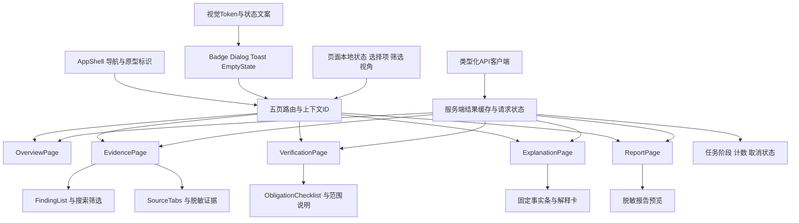

# 密证 V2：前端体验与视觉规范

本稿与离线原型共同用于用户评审，不代表业务前端已经实现。原型位于`prototype/index.html`，双击即可打开；所有记录、状态和验证案例均为预置模拟数据，不读取文件、不连接模型、不执行Git操作，也不生成报告文件。正式实现采用React、TypeScript和Vite，对接文档02的轻量后端及文档03的解释接口。

## 一 体验目标与信息优先级

界面定位为专业开发安全工作台：深海军蓝导航、轻内容面板、青绿色行动和限定通过、琥珀色待处置。信息密度适中，优先让用户看懂“哪份内容存在问题、依据是什么、副本验证到了哪里、原来源还剩什么”。不做攻击地图、无意义增长曲线、滚动数字或全局安全分数。

默认故事围绕CP-001示例：工作区在声明范围内未发现；原index仍有凭据；index导出副本经过限定验证；原index没有被修改。**P0不扫描历史，历史始终显示NOT_SCANNED与NOT_REQUESTED**，不能借副本通过把历史未知变成已清除。后续P1若获准加入最多10提交的有界历史，必须新增范围、来源记录及真实结果，不能提前在P0界面展示其完成。

所有页面顶部持续显示“方案原型 · 模拟数据”；数量是演示任务计数，不是准确率、覆盖率或实验成绩。原型提供一次重置操作，恢复初始界面状态；不会删除真实数据。

## 二 五页结构与主要交互

| 页面 | 首屏核心信息 | 主要交互与边界 |
|---|---|---|
| 总览 | 待处置发现、来源视图、副本验证、云端未验证状态 | 进入具体发现或验证计划；不把单一绿色卡片作为全仓结论 |
| 证据工作台 | 左侧发现列表，右侧来源状态、脱敏代码、判断依据 | 搜索与筛选、选择发现、工作区/index/历史切换；未执行来源没有伪造片段 |
| 修复验证 | 明确的计划、来源、副本范围与逐项义务 | 切换通过、同值残留、范围不完整三种预置案例；真实产品只展示后端判定 |
| AI研判 | 固定事实条、来源引用、解释与未知项 | 解释证据、建议下一步、能力边界三个展示视角；P0不是自由聊天产品 |
| 报告 | 限定结论、验证范围、剩余风险和未知状态 | 查看证据与模拟导出说明；原型不保存文件，正式报告取自已完成运行 |

三种AI按钮只切换同一解释结果的展示视角或确定性边界提示，不要求后端增加intent字段。正式`POST /api/explanations`仅使用`finding_id、snapshot_id、request_id`，最终展示已校验的`summary、advice、unknown_evidence_ids`等03规定字段；请求生命周期和轮询遵循03，不自行发明另一条聊天接口。

原型的修复、AI及报告页固定演示CP-001 / RP-DEMO-01。即使证据页选中了数据库或私钥，进入这些页也明确显示CP-001，不把另一条发现的证据混入演示。正式产品必须用路由ID与响应ID核对上下文，找不到对应计划时显示无计划状态，不能静默展示上一条结果。

## 三 前端组件与状态架构

正式路由建议为`/overview`、`/evidence/:findingId?`、`/verifications/:verificationId`、`/explanations/:findingId`、`/reports/:reportId`，通过查询参数或明确对象保存来源与snapshot_id。缺失ID时显示选择页，不构造一个假的完成对象。

服务端状态与页面状态分离。扫描和验证结果按run/job/snapshot等ID缓存；筛选、选中标签及解释展示视角只存页面状态。切换标签、重新渲染和模型解释不得改变verification.verdict、presence或coverage。晚到响应必须核对当前request_id与snapshot_id，不覆盖新选择。默认不把脱敏证据、解释文本或仓库位置写入浏览器localStorage。

未来代码可分为`src/app`、`pages`、`components`、`api`、`types`、`state`和`styles`。本期不引入复杂全局状态框架：优先类型化fetch封装、局部React状态和少量共享缓存；以实现清楚、便于Codex修改和人工理解为原则。组件不各自推导一套“安全”语义。

## 四 三层状态必须分开

| 层次 | 显示方式 | 禁止的推断 |
|---|---|---|
| 执行状态 | QUEUED、RUNNING、COMPLETED、FAILED、CANCELLED、INTERRUPTED | COMPLETED不等于检查通过，也不等于没有发现 |
| 来源存在性与完整性 | PRESENT等五态，加COMPLETE/INCOMPLETE/NOT_REQUESTED及采集版本 | PRESENT可与INCOMPLETE共存；空列表不能推导ABSENT |
| 修复验证 | 每项义务与限定汇总PASS/FAIL/UNKNOWN | 副本PASS不能关闭原index，不能证明云端撤销 |

界面同时展示机器状态和简明中文，例如“NOT_SCANNED · 尚未检查”“UNKNOWN · 范围不完整”。STALE必须保留旧记录与时间，并提示该记录不能当作当前事实。失败与未知使用不同文字、图标和色彩，不仅依靠颜色区分。

原型中切换“同值残留”后，报告与AI说明须同步保留FAIL；切换“范围不完整”后保留UNKNOWN。AI按钮不得偷偷恢复PASS。历史在全部页面保持未检查，不因为验证页切换而变化。回到总览时，其最新副本摘要也应使用当前案例状态，不能显示过期绿色结果。

## 五 任务进度与API反馈

仓库选择只来自`GET /api/repositories`中的已登记repo_id，不提供任意磁盘浏览。提交扫描或副本验证后，用后端返回的job_id轮询`GET /api/jobs/{id}`，显示真实阶段、处理计数、coverage、错误和结果ID。

没有总量时使用阶段说明与不定进度，不制作假百分比；有可靠总量时显示“已处理/计划对象数”，并单列跳过和失败。零发现但范围不完整时显示“尚无法判断”，不显示“全部安全”。运行中保留已持久化的发现，并标明结果仍未完成。

双击提交复用request_id，按钮在请求中短暂禁用；失败时保留可重试说明。点击取消后先显示“取消请求中”，收到后端确认才显示CANCELLED。进程重启留下的INTERRUPTED不得动画续跑到100%，需要用户明确重试并创建新任务。

409快照冲突时展示原snapshot与当前冲突原因，提示重新检查；页面不自动套用旧计划。报告按钮仅在后端返回可用report_id后启用，不因临时目录存在或某个步骤结束而提前启用。解释失败或模板降级不阻塞扫描与验证，也不改变其事实条；展示内容来源及降级原因。

## 六 视觉Token与排版

| 项目 | 建议值或规则 |
|---|---|
| 导航与页头 | 深海军蓝`#122437`，选中背景`#1E464C`，避免纯黑与高饱和霓虹 |
| 画布与面板 | 画布`#F3F6F8`、面板白、边线`#E3E9EF`；轻阴影，不堆玻璃效果 |
| 行动与限定通过 | 青绿`#087E78`、浅底`#E7F5F1`；通过标签同时写明副本及范围 |
| 待处置与失败 | 琥珀`#A06C1B`与浅底`#FFF5E3`；确定验证失败使用克制的红色 |
| 字体 | Microsoft YaHei为中文系统字体，英文回退Segoe UI；代码使用Cascadia Code/Consolas |
| 字号 | 主标题24—28px，卡片标题14—16px，正文12—14px；关键状态至少12px，辅助文案原则上不小于11px |
| 间距 | 6px为细节参考单位，主要使用12/18/24/30px；桌面内容边距约32px，移动端16px |
| 形状 | 面板圆角约14px、按钮8px、状态标签5px；图标使用原创线性SVG |

每张卡片只围绕一个问题组织内容。信息层级依次为结论、限定范围、证据链接、技术细节。HMAC或哈希不堆满首屏，展开后再显示完整标识；路径和代码可横向滚动于自身容器，不能撑破页面。证据状态图表达真实来源差异，不暗示历史天然与当前版本同步。

实际实施需检查文字与背景对比度，普通重要文字以至少4.5:1为验收目标；当前设计稿不声称已完成全套无障碍认证。不能为了“高级灰”把可执行的待办与未知提示淡化成不可读脚注。

## 七 响应式与键盘体验

1440×1000为主要桌面验收视口：固定约218px侧栏，内容按主次双栏组织，正文纵向滚动。中间宽度逐步降低栏数；390px移动宽度使用抽屉导航、两列概况卡及单列内容。表格隐藏非必要摘要列，保留发现、状态和进入详情按钮；被省略的路径与来源在详情中可见。

页面与document不能横向溢出。长状态码、路径、哈希和异常必须可换行或在专用容器滚动，不使用全局overflow:hidden遮盖问题。移动抽屉关闭时导航不得进入Tab顺序，打开后可Esc关闭并恢复焦点；对话框限制焦点范围，关闭后回到触发控件。

按钮使用button，来源切换使用tab语义并支持左右方向键。所有图标按钮具有中文可访问名称，键盘焦点可见。保留“跳到主要内容”入口，页面变化后将焦点移到主区域。Toast只作为补充反馈，重要失败必须留在页面中。状态更新用适当的aria-live，避免每次轮询重复朗读整页。

支持`prefers-reduced-motion`：关闭淡入、位移和过渡，不影响功能。正式视觉截图在动画稳定后获取；截图或评审不应将淡入半程当成最终颜色效果。

## 八 内容与隐私边界

展示原值使用明确占位描述，不给出看似真实的Token。脱敏片段不能切换为明文，完整补丁不出现在公开报告；源文件中看似指令的文本作为内容展示，不能执行。正式React渲染模型内容按纯文本或受限结构组件处理，不使用未经清洗的HTML。

报告只写“指定副本在声明范围内通过某些义务”，并保留原index、历史未检查和轮换未知。模型解释位于固定事实条下方，不能通过自然语言把UNKNOWN、STALE或NOT_SCANNED改成已通过。原型的模拟导出只弹说明，不创建“看起来真实”的证据文件。

## 九 原型验收清单与实施顺序

先完成AppShell、基础Token与五页空态，再接真实扫描列表和来源状态；随后接验证义务、报告和解释卡。14天内优先保证一条可信闭环，不增加大屏、主题市场、自由聊天、批量工作流编辑器或多用户设置。

原型应核查：五页均可切换；3项发现可筛选；来源未检查不会展示其他来源代码；三种验证案例可切换且报告/AI/总览保持一致；所有历史页面为NOT_SCANNED；从第三项发现进入固定AI示例时清楚标明CP-001；重置可恢复默认；模拟导出诚实说明；没有网络请求或文件操作；桌面与390px视口无页面溢出。

正式前端还要核查真实任务取消、重启中断、409冲突、迟到解释、失败降级和缺失结果。按钮可点击与视觉精致只证明界面完成，真实扫描、验证和模型接入仍需后端运行证据，不能由本原型替代。
