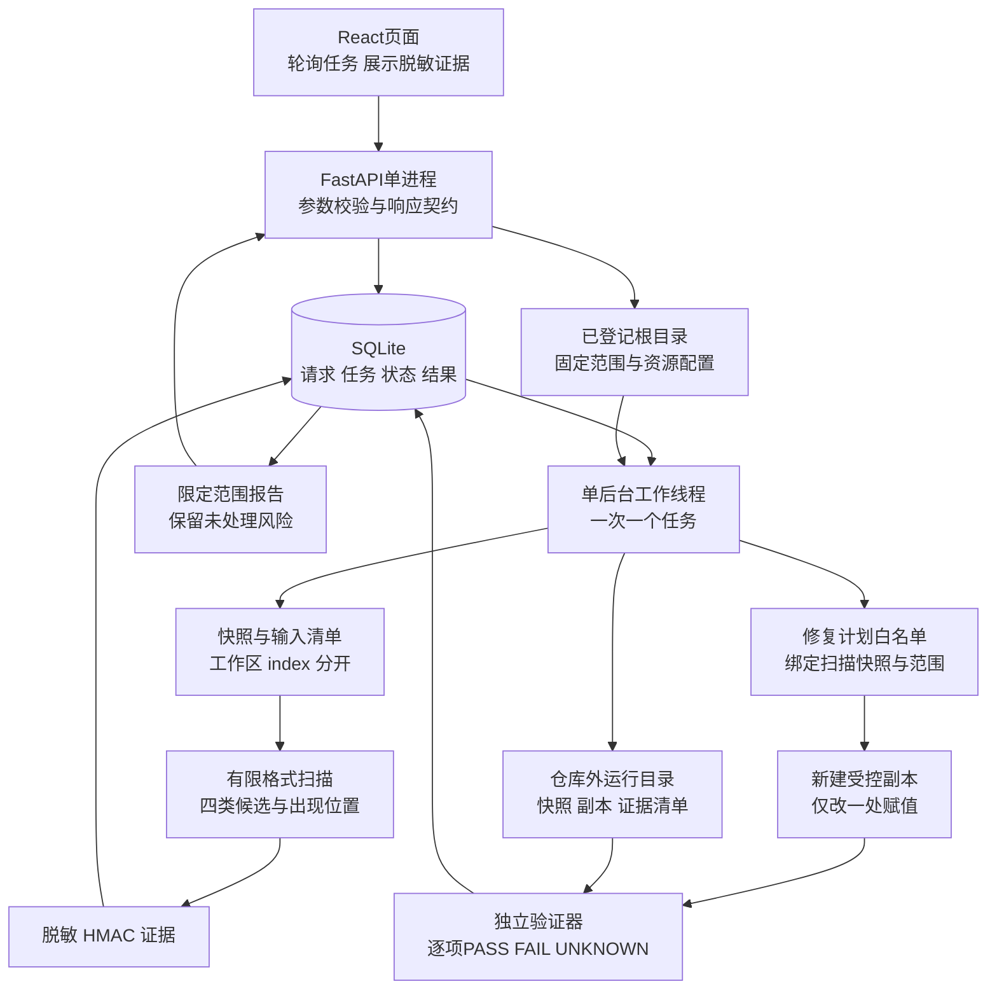
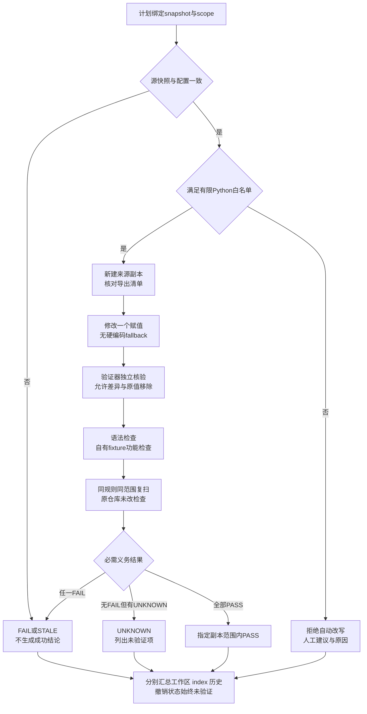
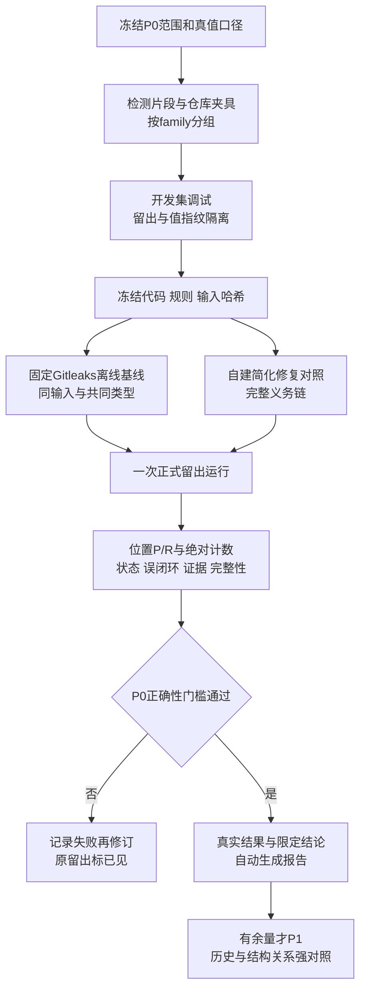

# 密证 CredProof V2 精简后端与验证契约

本文是待评审的实现方案，仅规划后端、验证和实验，不表示业务功能已经实现。V2面向十四天、核心负责人每天四至五小时验收、Codex承担主要开发的条件，把主线收敛为：**真实读取工作区与暂存区，生成受控副本，用绑定快照的验证义务链阻止“假修复成功”。** React负责展示，后端负责所有事实和结论。文中数量、范围和时限均为拟定参数，尚无性能实测。

## 一 实现范围与优先级

| 优先级 | 必须做到或明确删减 |
|---|---|
| P0 必交 | 工作区与index分别采集；四类有限格式候选；脱敏证据；固定快照；单个简单Python赋值的副本改写；独立验证义务；任务持久化；React真实数据联调；小规模冻结评估 |
| P1 有余量再做 | 当前分支第一父链最近少量提交的历史演示；有限JSON/Python对象内AK/SK配对；对应强基线与关系消融 |
| 本轮不做 | 微服务、Redis、Celery、RAG、多租户、登录权限体系、全网采集、云端凭据认证、批量自动修复、自动git add、历史重写及密钥撤销 |

P0检测四类为明确格式API Token、AK/SK元件候选、带认证信息DSN、PEM私钥。只支持少量列明的格式，generic字段单列为弱候选；不能把看到AK和SK两个字段直接称为确认配对。有限AST仅用于判断Python修复白名单，**用于检测的对象关系推理整体下放P1**。这保留修复可靠性，同时减少首版解析器与标注工作量。

P0历史始终显示`NOT_SCANNED`，不能用零条发现代替。P1拟定最多10个固定提交，按唯一blob去重，同时保留提交出现关系；上限以批准后的配置为准。历史只读追溯，不参与自动改写。没有P1也可完成P0验收，但报告必须保留历史未知和撤销待办。

## 二 一套进程和一条任务通路

采用 **FastAPI单进程、一个核心后台工作线程、SQLite、React静态页面**。扫描、副本生成和验证全局串行运行；API只接收请求、读取已落库结果并快速返回。模型解释通过同一FastAPI内的有界异步HTTP旁路调用本地Ollama，最多一个在途请求，不占用核心worker；其输入、输出和失败降级见03。Ollama是独立模型运行器，不是第二套业务后端。Git等外部命令可用带超时的短生命周期子进程，它们不是另一套常驻worker。首版不使用多进程Web worker或自动重载模式运行真实任务。

一个工作线程足够承担有界文本读取和轻量规则处理，可避免另建进程通信协议。取消在文件或验证步骤之间协作处理；线程不是安全沙箱，也不能靠强杀线程保证清理。Git子进程单独设置超时，正则和解析输入有固定大小上限，不允许页面上传任意规则或执行命令。

使用FastAPI的lifespan启动和停止工作线程；任务事实存在数据库，不依赖响应结束后的内存回调。这个持久化与恢复策略是本项目设计，需要自己实现。[FastAPI生命周期文档](https://fastapi.tiangolo.com/advanced/events/)

SQLite采用WAL、短事务和有限busy timeout。API连接与worker连接分别创建并在所属线程使用，不共享同一个连接；数据库访问层串行化短写事务，不在扫描期间持有数据库锁。页面建议约一秒轮询一次，具体值可调，并非吞吐或响应性能承诺。[Python sqlite3连接说明](https://docs.python.org/3/library/sqlite3.html#sqlite3.connect)

## 三 任务持久化与重启语义

提交任务先在事务中写`QUEUED`，成功落库后才返回`202`及job_id；相同request_id和相同请求体返回原任务，避免双击重复生成副本。相同request_id但参数不同返回冲突。worker领取任务时用条件更新把它改为`RUNNING`，记录本次进程session_id。单个实例锁防止两个程序同时启动各自worker。

任务执行状态为`QUEUED / RUNNING / COMPLETED / FAILED / CANCELLED / INTERRUPTED`。`COMPLETED`只表示所需步骤执行并持久化结束，**不等于发现为零或验证PASS**。每个任务另有coverage和业务结果；异常时保留已发现的证据和错误，不返回空结果假装成功。

启动恢复时，把旧进程留下的QUEUED或RUNNING任务标记为`INTERRUPTED`；未完成验证结果为`UNKNOWN`，不自动重跑，也不从残留文件推断成功。已有COMPLETED结果保留其历史结论，但重新使用前必须检查来源是否过期。用户重试创建新job_id、快照和副本，旧记录不覆盖。

每个任务先写独有的临时输出目录；只有证据文件写完、哈希核对完成并提交数据库最终结果后，报告才可用。文件系统与数据库不宣称跨系统原子提交：若文件存在但最终事务未完成，仍是未知残留。正常退出先停止接受新任务，在有限等待后记录中断；崩溃则由下一次启动恢复。取消请求在worker确认停止前仅显示“取消请求中”。

## 四 五态与coverage必须同时出现

| 存在状态 | 精确定义 |
|---|---|
| PRESENT | 在指定来源和观测版本确实发现；后续部分扫描失败也不能抹去这条证据 |
| ABSENT_WITHIN_SCOPE | 在冻结规则与声明范围完整执行后未发现该对象，只对该范围成立 |
| NOT_SCANNED | 没有请求或尚未读取该来源，包括P0未做历史 |
| FAILED | 已请求但未能完成，且没有可用于判定不存在的完整证据 |
| STALE | 旧观测对应的源快照已变化，不能作为当前事实使用；旧发现仍保留 |

每个来源另存`coverage=COMPLETE / INCOMPLETE / NOT_REQUESTED`，及计划对象数、成功处理数、声明排除项、失败项和资源截断原因。PRESENT可以与INCOMPLETE同时存在。标为STALE时保留旧的observed_state、时间和出现位置，不删除证据。

范围在任务开始前固定：支持的文本类型、显式排除目录、最大大小均写manifest。已声明范围外的对象公开列出，不推断其中没有泄露；范围内解码/权限失败、未合并index、多阶段冲突、超限或中途取消都使coverage不完整。`.env`不因隐藏属性默认排除。ignore或规则变化必须生成新配置和任务，不可通过缩范围给旧风险绿灯。

工作区采集实际读取字节并核对清单，index从索引对象ID读取blob，不能读工作区冒充暂存内容。它们有各自观测时间，不宣称操作系统级同步快照。修复前后重核相关来源；原index和工作区都保持只读。

## 五 最小模块与API

未来代码按职责拆成少量模块，不额外建设框架：`api.py`负责请求响应；`jobs.py`负责任务生命周期；`sources.py`负责路径、工作区/index和快照；`scan.py`负责格式候选；`repair.py`负责计划与副本；`verify.py`负责独立义务；`store.py`负责SQLite；`report.py`负责脱敏输出；`assistant.py`负责03所定义的模型解释旁路。P1历史与对象关系可各加一个模块。测试夹具与被扫描内容分开存放。

| 接口 | 主要用途与约束 |
|---|---|
| GET /api/repositories | 列出启动配置中登记的repo_id；不提供任意磁盘浏览 |
| POST /api/jobs | action为scan或copy_and_verify，传repo_id或plan_id与request_id；只入队 |
| GET /api/jobs/{id} | 返回执行状态、阶段、计数、coverage、错误及结果ID |
| POST /api/jobs/{id}/cancel | 请求协作取消，不立即伪造终止完成 |
| GET /api/scans/{id} | 汇总来源状态、范围、发现与脱敏出现位置；分页参数有上限 |
| POST /api/repair-plans | 传scan_id、occurrence_id、环境变量名；返回可修复或拒绝原因及不可变plan_id |
| GET /api/verifications/{id} | 返回每项义务、证据、来源状态和限定结论 |
| GET /api/reports/{id} | 由已完成结果导出脱敏JSON或HTML，不导出原始secret或可应用完整补丁 |

上表的八个接口仅是核心业务API，不是系统API总数。模型解释专用接口及输入/输出契约另见[03_轻量模型与隐私边界.md](03_轻量模型与隐私边界.md)，不计入这八个。

所有响应有版本字段和统一错误码。快照冲突返回409；参数/白名单问题返回明确业务错误；资源未找到与未扫描分开。React不得根据“请求200”“job完成”或“结果列表为空”自行推断成功，只渲染后端给出的状态与证据。

## 六 数据最小集合

| 核心表 | 字段重点 |
|---|---|
| jobs | id、request_id、action、params_hash、state、session_id、stage、timestamps、error、result_id |
| snapshots | id、repo_id、source、observed_at、manifest_hash、source_revision、scope_json、coverage_json、freshness |
| artifacts | id、snapshot_id、relative_path、blob_hash、encoding、read_state、skip_reason |
| findings | id、HMAC命名空间与指纹、类型、复核状态；不保存secret明文 |
| occurrences | finding_id、artifact_id、原始字节区间、行列、脱敏片段、rule_id |
| repair_plans | id、occurrence_id、snapshot_id、scope_hash、允许改动、env_name、plan_hash、适用/拒绝原因 |
| verifications | id、plan_id、job_id、copy_manifest_hash、verdict、obligations_json、source_states_json、report_hash |

七张表足够；事件与少量实验元数据可用JSON字段和JSONL，不另建关系图数据库。一个Finding可有多个Occurrence，禁止用全局“已修复”字段覆盖不同来源。规则/配置/代码版本放入运行清单，与表记录通过hash关联。

快照和副本留在项目Git仓库之外的受控运行目录，API只返回ID及脱敏摘要。HMAC密钥同样不入库、不提交Git；轮换密钥创建新命名空间。源文件可能含secret，原值仅在必要内存和受控快照中存在，不能说HMAC使快照也自动安全。可应用完整补丁含删除行，首版不提供公开下载；展示版本明确标注已脱敏、不可直接应用。

## 七 输入和执行边界

本地服务仅绑定loopback；React正式构建由同一服务提供。限制Host和Origin，变更请求须为结构化JSON并携带本地会话令牌；不开放通配CORS，也不把它部署到公网。repo_id只能映射启动配置里用户批准的根目录，接口不接受任意读文件路径、shell命令或下载URL。

路径规范化后必须位于选定根目录；拒绝绝对导出路径、`..`、符号链接/目录联接逃逸及Git树内链接对象。副本使用新建普通文件，不用硬链接或指向原仓库的链接；输出目录不能是输入目录的子目录。读取与写入前重新检查路径，发现变化即停止，不声称抵御本机恶意管理员的并发篡改。

Git只用固定只读命令及参数数组读取索引和对象，禁止shell拼接、hooks、checkout、clean/smudge过滤器、textconv和自动安装。P0优先支持普通本地仓库和UTF-8/UTF-8 BOM文本；子模块、LFS、链接和不支持编码明确列为范围外或失败。拟定文件上限2 MiB、单任务1000个文本对象和20 MiB总内容；超限不得标COMPLETE。调大限制是新运行配置，不能改变旧报告。

## 八 副本修复义务链

P0一次计划只改一个受支持Python模块级单目标字符串赋值，替换为无fallback的环境变量读取及必要标准库导入。多目标、f-string、拼接、三引号、函数参数、作用域歧义和导入冲突拒绝。DSN内部字段、JSON、`.env`和私钥只给建议。既不修改原文件，也不更新index；历史仅保留风险。

验证器独立读取快照与副本，不接受修复器的“已完成”作为证据。最低义务包括：源快照一致、导出与检查范围完整、变更只在计划位置、原值确实移除、语法有效、限定功能检查完成、同规则复扫完成且无新增受检问题、原文件/index未变、其他来源状态如实保留。

原值移除除字节检查外，还检查受支持Python字面量解码值，避免只改成转义形式。范围与计划一致，不能因为只自动改一处就只扫描那一行；其他文件或注释残留同值仍使移除义务FAIL，未覆盖对象则UNKNOWN。

功能检查仅执行项目自有、预先审阅的fixture与固定验证器：注入dummy环境值后实际读取；移除变量后预期明确失败；检查无旧值回退。不导入任意用户模块、不运行仓库tests或安装脚本。实际用户仓库没有批准且适用的功能检查时返回UNKNOWN，只能显示语法/移除等已完成项。自有fixture通过不替代真实项目业务回归。

总判定为：任一必需义务FAIL则FAIL；无FAIL但存在UNKNOWN则UNKNOWN；全部PASS才得到“指定副本在声明范围内验证通过”。原index仍PRESENT、历史未扫描或旧凭据未撤销，可以与这个局部PASS共存；它们阻止整项风险被宣称已关闭。用户实际应用补丁和轮换密钥始终是后续待办。

## 九 轻量评估与验收

P0优先证明义务链确实拒绝假成功，算法领先不是交付前提。检测进一步缩到**约120片段：12个独立模板family，每族约10片段，固定8族开发、4族留出**。示例分配是每个类型3族，其中2族开发、1族留出，即约80开发与40留出。必须先列明family的独立语法/上下文骨架和分组，再生成正负片段；不能把同一模板仅换值或变量名后跨集，也不能观察结果后改分组。P1才考虑扩到约240片段，且新增独立骨架，不能靠复制充数。四类元件/位置检测与AK/SK关系分开计分，弱候选单报。P0不做关系推理时，配对能力写未实现。

状态与修复沿用24个独立小仓库场景，12开发/12留出；其中历史真实读取案例移至P1，P0以“历史未扫描绝不能显示清洁”验收其接口语义。两侧按场景生成family隔离，留出至少覆盖下列风险，不靠替换同一模板中的值制造独立样本。

| P0必测条件 | 应有结果 |
|---|---|
| 工作区干净但index保留明文 | 两来源不同状态，不能关闭暂存风险 |
| 未做历史扫描 | NOT_SCANNED，不显示历史无风险 |
| 忽略规则或范围在修复后收缩 | 计划冲突或UNKNOWN，不能空结果绿灯 |
| 扫描后文件/index变化 | STALE，旧计划不可当当前事实 |
| 改写语法坏、缺失env仍静默继续、旧值fallback残留 | 对应义务FAIL；正常缺失env明确失败则是预期行为 |
| 副本其他位置仍有原值 | 原值移除FAIL，不因目标行干净放行 |
| 读取/复扫失败、超限、取消或程序重启 | 不完整或UNKNOWN，绝不假成功 |
| 副本实际是链接或原文件/index变化 | 拒绝或FAIL，保留证据 |
| 不支持输入与未获准功能执行 | 明确拒绝/UNKNOWN，不运行任意脚本 |

外部基线只选冻结版本Gitleaks，所有工具用共同输入清单和共同支持类型。修复对照是自建“删文本后只复扫”的简化流程，不冒充任何开源产品默认行为。P1若做对象配对，则增加同候选plain消融与Gitleaks开发集调好的Composite Rules强对照；未实现P1时不宣称超越现有配对能力。[Gitleaks组合规则说明](https://github.com/gitleaks/gitleaks#composite-rules-multi-part-or-required-rules)

P0报告TP/FP/FN与位置级P/R、状态正确计数、错误闭环数、证据完整率、原仓库不变、修复适用/拒绝/通过数。聚合风险数独立展示，不混用分母。语法、功能、复扫每项都有实测状态；不设置98%等预填效果。性能只记录同环境实际耗时与规模，不扩大成高并发承诺。

正确性硬门槛是在冻结验收范围内：假成功全部被阻止，原仓库未被程序修改，未扫/失败/过期不伪装干净，报告无明文。算法效果可能落后基线，应保留结果，不把完成工程义务说成检测SOTA。数据、split、代码、工具、规则和命令均有哈希与版本；调过留出失败后必须披露该留出已参与迭代。

## 十 十四天内的取舍

详细排期以[04_实施排期与Git交付.md](04_实施排期与Git交付.md)为准。前两天先完成前端骨架、主要页面和API展示契约；第3—8天边实现采集、扫描、修复与验证边联调React，至第8天形成真实端到端闭环；第9天接模型解释；第10—11天冻结并运行实验；第12—14天精修界面、验证干净环境、完成材料与交付。不能把前后端联调留到最后三天。此为安排建议，不是交付保证；负责人每天重点验收一个闭环，文档同伴同步整理已确认的证据。

第八天仍未打通P0义务链时，直接取消P1。AST关系、历史和额外扫描器不能挤占重启语义、真实fixture功能验证、原仓库不变及失败展示。完成的标志是界面能够如实呈现真实运行的PASS、FAIL、UNKNOWN和未扫来源，而不是页面上每个模块都出现绿色数字。
