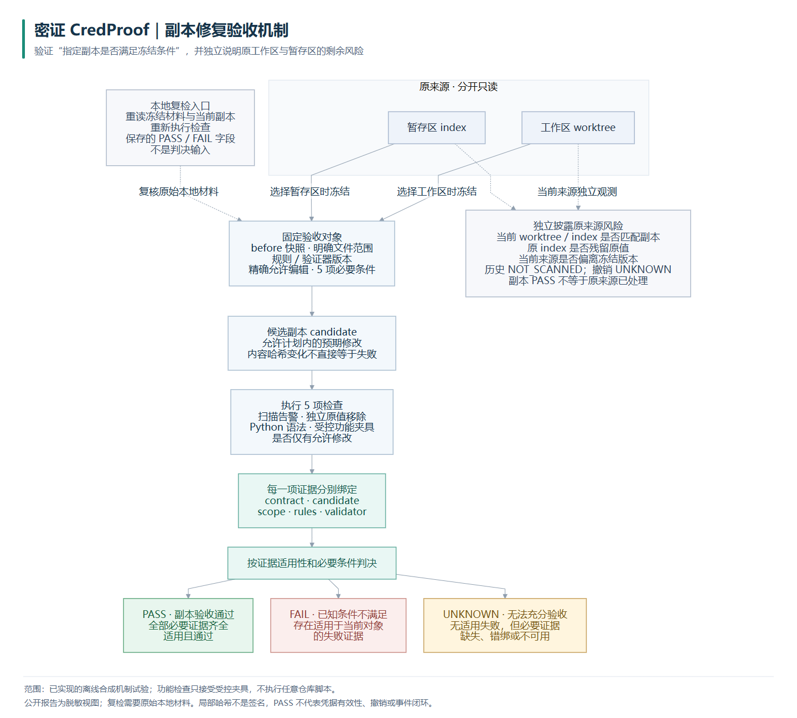

# 密证 CredProof：初赛定位与收敛方案

更新：2026-09-29。当前执行方案以本目录为准，`docs/plan-v2` 保留为历史设计，不覆盖其中原型。本轮已实现命令行机制验证，尚未实现正式前端/API，也尚未完成独立留出评测或最终比赛提交包。

## 1. 一句话贡献与问题

**把一次凭据修复的“通过”限定到具体副本、范围和条件，并通过重新读取材料检查证据是否仍适用，避免把零告警、越界修改或不同对象上的通过结果误当成一次合格修复。**

作品名：**密证 CredProof——面向凭据修复的证据化验收系统**。

用户能讲清的问题是：“密钥从代码里消失了，程序是不是还能按约定工作？昨天的通过，今天改了文件以后还能算数吗？”范围是修复验收，不是全面凭据治理。单独做扫描、测试、摘要绑定都已有先例；本作品把这些能力落实为一个有限、可重跑、可实验证伪的验收方法，不主张新检测算法或密码学证明。

研究假设：相对只复扫或复扫加常规检查，显式约束允许修改、对象版本、检测范围与必要证据，可以减少不合格修复或不适用证据被接受，同时维持有效修复的通过率和可接受开销。**目前只完成开发可见的机制试验；假设的泛化效果尚未确立。**

## 2. 摘要草稿（约 300 字，低于官方 500 字限制）

代码中不再出现凭据，并不意味着修复已经合格：程序可能失去必要行为，验收也可能沿用旧版本或缩小范围后的结果。密证 CredProof 面向这一问题，设计带适用条件的修复验收契约。系统在修改前冻结源快照、检测范围、规则、允许编辑及必要条件，在受控副本中完成有限 Python 修复，并将残留、语法、受控功能和修改范围检查绑定到同一候选对象。仅当必要证据齐全且适用时通过，发现反例则失败，证据不足或过期则标为未知；副本结论与原工作区、暂存区和外部撤销状态分别呈现。作品复用 Gitleaks，提供脱敏记录和重新读取材料的复检入口。首轮以合成仓库验证错误修复、正确修复和证据失效，并与复扫、复扫加测试及去绑定方法比较。结果只支撑受控场景的工程可行性，不代表任意程序正确、真实企业部署效果或泄露事件已经闭环。

## 3. 相对 V2：保留、冻结、重写

| 处理 | 本轮决定 | 原因 |
|---|---|---|
| 保留 | Python 核心；后续仍用 React/TypeScript/Vite 和薄 FastAPI；保留 V2 配色、字体、组件方向 | 不重写已有成果，但界面必须接真实执行结果 |
| 保留并实现 | worktree/index 分开读取、受控副本、脱敏、确定性判决、显式剩余风险 | 服务于验收对象与结论边界 |
| 从初赛必做中删除 | 五个独立页面、四类凭据覆盖指标、总览大屏、复杂任务管理 | 不帮助本轮验证贡献 |
| 冻结 | 历史扫描、多语言修复、复杂凭据关系、云撤销、多人协作、调度；Qwen/Ollama | 无模型也必须成立；不训练、不微调，GPU 不构成依赖 |
| 重写 | “前端优先”改为机制、反例和实验优先 | 先证明做得出、说得清，再做精致展示 |
| 重写 | “复扫通过”改为逐项适用的 PASS/FAIL/UNKNOWN | 检查结果不可相互替代，不适用的绿色结果不参与当前判决 |
| 重写 | V2 的 STALE 拆为证据适用性与当前来源风险 | 原工作区后续变化不自动否定一个固定副本的结论；应用回原仓库另需源状态匹配 |
| 重写 | 功能巡游改为连续三段故事；实验先做小试验而非预写高分数字 | 初赛提交真实程序与证据 |

本轮不创建持久任务服务、数据库或多层框架。CLI、纯 Python 核心和 Gitleaks 适配器已足以验证机制；SQLite 只有后续界面确有保存任务需求时再接入。

## 4. 核心机制：检查的是“本次结论成立的条件”

### 4.1 契约与预期变化

冻结内容包括：选用 worktree 还是 index；显式文件清单；修复前各文件摘要；目标赋值与环境变量名；唯一允许替换的字节区间与替换内容摘要；预期副本摘要；检测器版本/可执行文件及规则摘要；验证器摘要；必要检查列表和受控功能规范。

本轮只支持 UTF-8 无 BOM、一个模块级单行字符串赋值 `SERVICE_TOKEN = "合成标记"`，源文件已有 `import os`，改为 `os.environ["CP_DEMO_TOKEN"]`。不会插入复杂导入、理解任意业务代码或猜测替代修复。上限 32 个显式文件，每个 128 KiB。读 Git index 的实际 blob，工作区单独读文件，不用工作区推测 index。冻结后原仓库和 index 只读。

**正常修复当然会改变文件。** 比较基准是由冻结原件和精确允许编辑重新构造的“预期副本”，不是要求修复后等于修复前。计划内替换可通过；额外改注释、伴随文件等，即使不影响演示功能，也违反本次精确授权契约。允许范围很窄，这是本轮的明确适用限制。若用户需要另一种有效补丁，应先重新制定契约，而不是拿旧授权强行通过。

### 4.2 五项义务与绑定

| 义务 | 实际实现 | 不能声称的能力 |
|---|---|---|
| 复扫 | 固定 Gitleaks 8.28.0、固定合成规则，对实际读取的范围扫描；错误不是零告警 | 没有评估默认规则覆盖率或真实秘密检出率 |
| 目标移除 | 原值精确字节与可解析 Python 字符串常量检查 | 不穷举加密、拼接、编码或所有间接传播 |
| 语法 | 声明范围内 Python 文件用 AST 解析 | 语法通过不等于业务正确 |
| 受控功能 | 明确允许的 `authorization-header-v1` 闭合语法；两个环境值应产生对应 Bearer 头，变量缺失应报错 | 不执行任意项目脚本、依赖、测试、导入或网络请求；不证明任意业务语义等价 |
| 允许修改 | 根据冻结原件独立重建预期编辑，核对完整副本清单及内容 | 不是通用补丁正确性判定器 |

每项实际证据都带 `contract_id / candidate_id / scope_id / rules_id / validator_id`。其中 candidate_id 来自当次完整副本清单和读取异常，scope_id 来自**实际检查范围**。验收再次读取当前对象及规则，逐项比较绑定；不能只核对报告顶层的一个哈希。缺文件、检查未执行、版本不同、规则不同或范围被缩小都不能继续沿用原来的通过。

当前消融移除的是整组绑定校验，并非已分别隔离“版本”和“范围”各自贡献。规则文件即使只改注释也算身份变化，可能保守地产生 UNKNOWN；本轮不做语义等价配置判断。原件、私有见证或契约不完整时，复检不能恢复有效结论。

### 4.3 判决语义与四种状态分离

1. 先判每条证据是否对当前契约、候选、范围、规则和验证器适用。不适用证据变为 UNKNOWN，不把旧 FAIL 当作当前反例。
2. 存在一个**适用的明确反例**，总体 FAIL；否则有必要证据缺失或未知，总体 UNKNOWN；否则才 PASS。
3. 同一报告分别列：副本验收结论、原工作区是否匹配副本、当前 index 是否仍有目标值、外部撤销 UNKNOWN。历史固定记为未扫描。

原工作区/暂存区被其他操作者改动时，系统重新读出它们的当前状态和“是否与冻结时一致”。只要固定副本及必要证据仍适用，副本可以 PASS；这**不授权自动应用**，更不证明真实密钥已撤销。本轮没有自动应用命令。

### 4.4 脱敏记录和独立复检

`public/` 记录契约脱敏视图、执行义务、状态与原因、对象和范围摘要、剩余风险；不输出目标原值、匹配文本或源仓库绝对路径。包含原值的路径键和值也脱敏。原始样例、修复前副本、私有目标见证留在被 Git 忽略的本机 `runs/` 中。

`python -m credproof recheck --bundle <匹配材料目录>` 会重新读原件和候选、重建计划、运行实际检查，再产生新的结论；不会读取保存的 PASS。只有脱敏 JSON 而没有匹配材料，不能完成独立复检。公开报告便于审阅，匹配的受控材料与复检程序才使实验可重复。

本轮可信边界是操作者控制的本地环境。普通摘要和本地 HMAC 只是对象一致性/目标关联手段，没有第三方签名、可信时间戳或独立执行者；无法防止有完整本机控制权的人同时伪造材料和元数据。遇到可疑报告应重新执行检查，不能仅信保存的字段。

## 5. 问题 → 已有能力 → 增量 → 证据 → 边界

| 环节 | 可以向评委直接讲的话 |
|---|---|
| 真实问题 | 零告警不表示修复保持了功能；不同时间、不同范围的通过也不能直接拼接 |
| 已有能力 | Gitleaks/TruffleHog/GitHub 已有检测、暂存相关支持或凭据有效性能力；自动程序修复研究也已指出“通过测试”不等于正确 |
| 我们的增量 | 在一个很窄的凭据修复场景，把允许编辑与每条证据的适用条件变成可执行验收规则，并明确分开副本与事件剩余风险 |
| 本轮实验依据 | 同引擎、同输入比较 A/B/C 及去绑定消融，额外展示重新采证的 B-fresh；真实命令和逐案例结果见 03 |
| 适用边界 | 合成数据、开发可见、有限语法、精确编辑；相同约束可在规范 CI 中实现，不主张优于完整 CI 或适用于任意项目 |

相关工具能力、两篇研究原文和当前赛事模板逐项核查见 [01](01_related_work_and_template.md)，实验协议见 [02](02_experiment_protocol.md)。

## 6. 主机制图与后续单页展示

主图见 [PNG](diagrams/mechanism.png)、[矢量 SVG](diagrams/mechanism.svg)、[Mermaid 图源](diagrams/mechanism.mmd)。图的阅读主线是“冻结什么 → 实际查什么 → 证据适用于谁 → 能下什么结论”，不按菜单组织。原来源风险独立披露，不作为外部撤销未验证就强行否决副本的开关。

后续页面只做一个“验收工作台”：上方显示限定结论与范围；中间左侧是脱敏的修复前后差异，右侧是五项执行证据；下方四格显示副本、原工作区、index、撤销；底部展示冻结/执行/复检时间线及下载。点击任一义务能看到真实范围、对象摘要和原因，不先填绿色数字。沿用 V2 沉稳底色、清晰字号和留白，优先可读性，不做装饰性态势大屏。V2 模拟原型继续明显标注模拟，不充当正式演示页面。

## 7. 单人＋Codex 的 12 天基准计划

按本人每天 **4—5 小时**，合计约 **48—60 小时**安排；其中理解方案、决定范围和练习讲解也计入，不把文档另塞到“开发完成之后”。Codex 负责实现、自动试验和整理草稿，你负责需求与案例合理性、现场复核、作者声明及最终提交。

| 天 | 主要工作与产出 | 本人时间重点 / 当日停止条件 |
|---|---|---|
| 1 | 本轮：核心契约、3 段真实演示、16 例试验和取舍 | 读懂一条 PASS 与一条 UNKNOWN；本轮产物已完成，不重做 |
| 2 | 独立设计留出模板和预期断言；冻结协议 | 2h 审案例差异，1h 理解正确修复需求，1—2h 核对报名与模板 |
| 3 | 按模板隔离扩展至约 30—50 个实质案例，运行合理基线/消融 | 审核结果与失败。没有足够不同模板就少报，不能重复字符串凑数 |
| 4 | 只修被实验暴露的机制问题，重测受影响项；冻结候选发布版本 | 阅读差异与统计。若合理基线没有差异，收缩贡献，不追补有利样例 |
| 5 | 用薄 FastAPI 接核心，单页工作台接真实结果 | 评审“为什么 PASS/UNKNOWN”是否一眼能看懂 |
| 6 | 单页修复差异、复检和剩余风险；必要的视觉打磨 | 真实走三段故事；无新业务模块 |
| 7 | 按官方章序写概述、设计实现、创新说明与参考来源 | 本人用自己的话改写核心解释；Codex 整理图和证据引用 |
| 8 | 写测试分析和局限；生成匿名报告草稿 | 复核每个数字的分母、来源、样例属性与负结果 |
| 9 | 干净目录打包运行程序，整理复现命令、版本、许可证 | 本人按 README 从零运行；缺依赖/失败都必须可见 |
| 10 | 报告排版、匿名/元数据/大小检查，审源码和提交包 | 检查模板要求；视频或截图只是补充，不能代替可执行程序 |
| 11 | 录制三分钟演示（如提交需要），练习五个追问 | 至少两次脱稿讲述，不背术语；修讲不清的段落 |
| 12 | 重走复现流程、提交平台要求核对、备份和提交 | 保留余量处理上传/资格审核，不在最后一天加功能 |
| 13—14 | 仅留作缺陷、打包、学校流程和答辩练习缓冲 | 不借缓冲期加入 AI、更多语言或历史扫描 |

如果只有 10 天，合并第 5—6 天的界面任务、合并第 7—8 天的写作任务；减少界面装饰，保留独立评测、打包复现和本人练习。不会为了赶工取消正确修复正例或把 UNKNOWN 渲染成成功。

## 8. 官方模板映射与本轮停止点

| 官方位置 | 可复用材料 | 仍需补齐 |
|---|---|---|
| 摘要 / 第一章作品概述 | 本文 1—3、5 | 本人复述并审定 |
| 第二章作品设计与实现 | 本文 4、6，核心源码与主图 | 正式单页接入后的真实截图 |
| 第三章作品测试与分析 | 02 协议、03 结果与可重跑脚本 | 独立留出评测和发布环境复现 |
| 第四章创新性说明 | 01 相关工作、本文 5、03 诚实问答 | 仅保留最终实验支撑的陈述 |
| 第五章总结 / 参考文献 | 03 局限、01 官方/论文来源 | 最终统一文献编号和格式 |
| 可执行程序 / 声明 | 现有真实 CLI、源码与开源归属说明 | 干净环境运行包、必要依赖和声明签署 |

本轮 Markdown 是可直接转入模板的内容稿，不声称已经得到排版合格的最终 DOC/PDF。正式报告须按官方模板匿名，不放本机用户名、GitHub 个人主页、作者 Git 历史或可识别身份的截图；开源归属保留项目名与许可证。源码打包按赛事要求另处理，不能通过伪造作者声明隐瞒 AI 辅助。仓库公开性由用户管理，本轮只做本地提交。

**下一步优先做不同模板的独立留出评测，检查现有优势是否仍成立。** 若只有“规范 CI 也能做到”的工程整合价值，就如实定位；若出现关键反例或正确修复大量被拒绝，先调整机制，不进入界面扩建。
